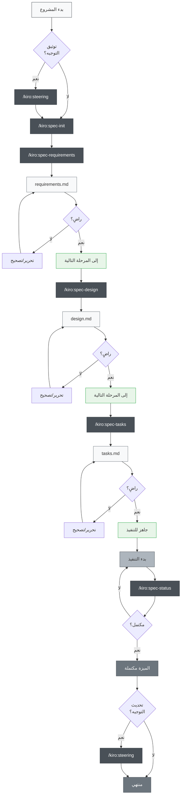
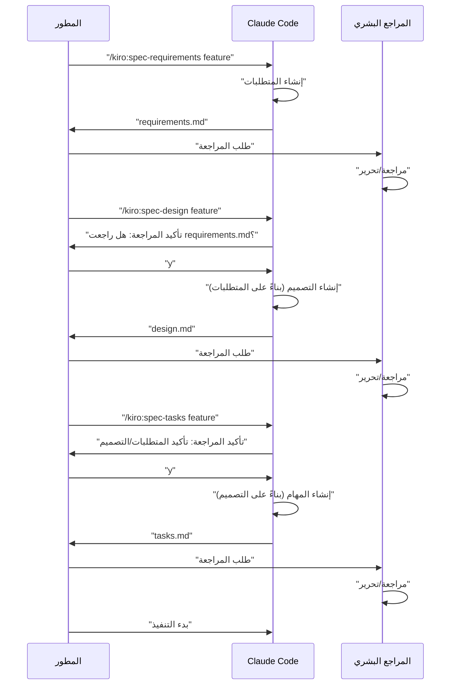

# تطوير Claude Code القائم على المواصفات

> 🌐 **اللغة**  
> 📖 **[English Version](README_en.md)** | 📖 **[日本語版 README](README.md)** | 📖 **[简体中文说明](README_zh-CN.md)** | 📖 **[繁體中文說明](README_zh-TW.md)** | 📖 **العربية** (هذه الصفحة) | 📖 **[فارسی](README_fa.md)** | 📖 **[Русский](README_ru.md)**


> [!Warning]
> إصدار أولي، سيتم تحسينه بشكل مستمر أثناء الاستخدام

📝 **مقالات ذات صلة**  
**[Kiroの仕様書駆動開発プロセスをClaude Codeで徹底的に再現した](https://zenn.dev/gotalab/articles/3db0621ce3d6d2)** - مقال Zenn

مشروع لممارسة التطوير القائم على المواصفات (Spec-Driven Development) المدمج في Kiro IDE باستخدام أوامر Slash وCLAUDE.md في Claude Code. يعيد إنتاج تدفق التطوير القائم على المواصفات الفعلي في Kiro بشكل شبه كامل، بما في ذلك بنية الدليل.

## نظرة عامة

يوفر هذا المشروع مجموعة أدوات لإجراء التطوير القائم على المواصفات بكفاءة من خلال الاستفادة من أوامر Slash في Claude Code. باستخدام الأوامر المناسبة في كل مرحلة تطوير، يمكن تحقيق عملية تطوير منهجية وعالية الجودة.

## الإعداد

### الاستيراد إلى مشروعك

لاستيراد التطوير القائم على المواصفات في Claude Code إلى مشروعك، ما عليك سوى نسخ الملفين/الدليلين التاليين:

1. **دليل `.claude/commands/`** - تعريفات أوامر Slash
2. **ملف `CLAUDE.md`** - إعدادات Claude Code وتعليمات المشروع


### خطوات الإعداد الأولي

1. **نسخ الملفات** (انظر أعلاه)
2. **نسخ CLAUDE.md** وتعديله وفقاً لمشروعك
3. **تنفيذ الأمر الأول**:
   ```bash
   # اختياري: إنشاء وثائق التوجيه
   /kiro:steering
   
   # إنشاء أول مواصفة ميزة
   /kiro:spec-init "وصف تفصيلي لمشروعك"
   ```

### بنية الدليل المطلوبة

عند تنفيذ الأوامر، سيتم إنشاء الأدلة التالية تلقائياً:

```
مشروعك/
├── .claude/
│   └── commands/          # تعريفات الأوامر المنسوخة
├── .kiro/
│   ├── steering/          # وثائق التوجيه المُنشأة تلقائياً
│   └── specs/             # مواصفات الميزات المُنشأة تلقائياً
├── CLAUDE.md              # منسوخ من ملفات لغة محددة (مثل: CLAUDE_en.md, CLAUDE_zh-TW.md) ومعاد تسميته
├── CLAUDE_en.md           # إعدادات Claude Code بالإنجليزية
├── CLAUDE_zh-TW.md        # إعدادات Claude Code بالصينية التقليدية
├── README.md              # README باليابانية
├── README_en.md           # README بالإنجليزية
├── README_zh-TW.md        # README بالصينية التقليدية
└── (ملفات مشروعك)
```

## كيفية الاستخدام

### 1. في حالة مشروع جديد

```bash
# اختياري: إنشاء توجيه المشروع (موصى به لكن ليس إلزامي)
/kiro:steering

# الخطوة 1: بدء إنشاء مواصفات الميزة الجديدة (تضمين وصف تفصيلي)
/kiro:spec-init "أريد إنشاء ميزة حيث يمكن للمستخدمين تحميل ملفات PDF، واستخراج الرسوم البيانية، وسيشرح الذكاء الاصطناعي المحتوى. حزمة التقنية تستخدم Next.js وTypeScript وTailwind CSS."

# الخطوة 2: تعريف المتطلبات (استخدام feature-name المُنشأ تلقائياً)
/kiro:spec-requirements pdf-diagram-extractor
# ← مراجعة/تحرير .kiro/specs/pdf-diagram-extractor/requirements.md

# الخطوة 3: التصميم التقني (موافقة تفاعلية)
/kiro:spec-design pdf-diagram-extractor
# ← الرد على "هل راجعت requirements.md؟ [y/N]"
# ← مراجعة/تحرير .kiro/specs/pdf-diagram-extractor/design.md

# الخطوة 4: إنشاء المهام (موافقة تفاعلية)
/kiro:spec-tasks pdf-diagram-extractor
# ← الرد على تأكيد مراجعة المتطلبات والتصميم
# ← مراجعة/تحرير .kiro/specs/pdf-diagram-extractor/tasks.md

# الخطوة 5: بدء التنفيذ
```

### 2. إضافة ميزة إلى مشروع موجود

```bash
# اختياري: إنشاء/تحديث التوجيه
# استخدام نفس الأمر للإنشاء الجديد والتحديث
/kiro:steering

# الخطوة 1: بدء إنشاء مواصفات الميزة الجديدة
/kiro:spec-init "اكتب وصفاً تفصيلياً للميزة الجديدة هنا"
# بعد ذلك نفس المشروع الجديد
```

### 3. التحقق من التقدم

```bash
# التحقق من تقدم ميزة معينة
/kiro:spec-status my-feature

# سيتم عرض المرحلة الحالية، حالة الموافقة، تقدم المهام
```

## عملية التطوير القائم على المواصفات

### مخطط تدفق العملية

في هذا التدفق، كل مرحلة تتطلب "المراجعة والموافقة".

**وثائق التوجيه** هي وثائق تسجل المعرفة الدائمة حول المشروع (البنية، حزمة التقنية، معايير الكود، إلخ). الإنشاء/التحديث اختياري لكن موصى به لتحسين قابلية صيانة المشروع على المدى الطويل.



## قائمة أوامر Slash

### 🚀 المرحلة 0: توجيه المشروع (اختياري)

| الأمر | الاستخدام | وقت الاستخدام |
|---------|------|---------------|
| `/kiro:steering` | إنشاء/تحديث وثائق التوجيه بذكاء | جميع السيناريوهات (جديد وتحديث) |
| `/kiro:steering-custom` | إنشاء وثائق توجيه مخصصة | عند الحاجة لمعايير أو إرشادات خاصة |

**ملاحظة**: وثائق التوجيه موصى بها لكن ليست إلزامية. يمكن إغفالها لإضافات الميزات الصغيرة أو التطوير التجريبي.

#### أنواع وثائق التوجيه
- **product.md**: نظرة عامة على المنتج، الميزات، حالات الاستخدام
- **tech.md**: البنية، حزمة التقنية، بيئة التطوير
- **structure.md**: بنية الدليل، معايير الكود، قواعد التسمية
- **وثائق مخصصة**: معايير API، استراتيجية الاختبار، سياسة الأمان، إلخ

### 📋 المرحلة 1: إنشاء المواصفات

| الأمر | الاستخدام | وقت الاستخدام |
|---------|------|---------------|
| `/kiro:spec-init [وصف تفصيلي للمشروع]` | تهيئة بنية المواصفات من وصف المشروع | عند بدء تطوير ميزة جديدة |
| `/kiro:spec-requirements [feature-name]` | إنشاء وثيقة تعريف المتطلبات | مباشرة بعد تهيئة المواصفات |
| `/kiro:spec-design [feature-name]` | إنشاء وثيقة التصميم التقني | بعد الموافقة على المتطلبات |
| `/kiro:spec-tasks [feature-name]` | إنشاء مهام التنفيذ | بعد الموافقة على التصميم |

### 📊 المرحلة 2: إدارة التقدم

| الأمر | الاستخدام | وقت الاستخدام |
|---------|------|---------------|
| `/kiro:spec-status [feature-name]` | التحقق من التقدم والمرحلة الحالية | في أي وقت أثناء التطوير |

## سير عمل الموافقة ثلاثي المراحل

جوهر هذا النظام هو طلب المراجعة والموافقة البشرية في كل مرحلة



## أفضل الممارسات

### ✅ الممارسات الموصى بها

1. **البدء دائماً بالتوجيه**
   - استخدام `/kiro:steering` في جميع السيناريوهات (يحدد بذكاء الإنشاء/التحديث)
   - الأمر المدمج يحمي الملفات الموجودة ويعالجها بشكل مناسب

2. **عدم تخطي المراحل**
   - الالتزام الصارم بترتيب المتطلبات ← التصميم ← المهام
   - إجراء مراجعة بشرية في كل مرحلة

3. **التحقق الدوري من التقدم**
   - فهم الوضع الحالي باستخدام `/kiro:spec-status`
   - تحديث حالة إكمال المهام بشكل مناسب

4. **صيانة التوجيه**
   - تنفيذ `/kiro:steering` بعد التغييرات الكبيرة (يحدد التحديث تلقائياً)
   - التحديث مع نمو المشروع

### ❌ ما يجب تجنبه

1. **الانتقال للمرحلة التالية بدون موافقة**
   - عدم نسيان الرد على تأكيد المطالبة

2. **إهمال وثائق التوجيه**
   - المعلومات القديمة تعيق التطوير

3. **عدم تحديث حالة المهام**
   - يصبح التقدم غير واضح والإدارة صعبة

## بنية المشروع

```
.
├── .claude/
│   └── commands/          # تعريفات أوامر slash
│       └── kiro/
│           ├── spec-init.md
│           ├── spec-requirements.md
│           ├── spec-design.md
│           ├── spec-tasks.md
│           ├── spec-status.md
│           ├── steering.md          # أمر التوجيه المدمج
│           └── steering-custom.md
├── .kiro/
│   ├── steering/          # وثائق التوجيه
│   │   ├── product.md
│   │   ├── tech.md
│   │   └── structure.md
│   └── specs/             # مواصفات الميزات
│       └── [feature-name]/
│           ├── spec.json      # حالة موافقة المرحلة
│           ├── requirements.md # وثيقة تعريف المتطلبات
│           ├── design.md      # وثيقة التصميم التقني
│           └── tasks.md       # مهام التنفيذ
├── CLAUDE.md              # الإعدادات الرئيسية (منسوخة من أحد ملفات اللغة أدناه)
├── CLAUDE_en.md           # الإعدادات بالإنجليزية
├── CLAUDE_zh-TW.md        # الإعدادات بالصينية التقليدية
├── README.md              # README باليابانية
├── README_en.md           # README بالإنجليزية
├── README_zh-TW.md        # README بالصينية التقليدية
└── (ملفات مشروعك)
```

## ميزات الأتمتة

تم أتمتة ما يلي من خلال ميزة الخطافات في Claude Code:

- التتبع التلقائي لتقدم المهام
- فحص الامتثال للمواصفات
- الحفاظ على السياق عند الضغط
- اكتشاف انحراف التوجيه

## استكشاف الأخطاء وإصلاحها

### عندما لا تعمل الأوامر
1. التحقق من وجود دليل `.claude/commands/`
2. التحقق من قواعد تسمية ملف الأوامر (`command-name.md`)
3. التحقق من استخدام أحدث إصدار من Claude Code

### عند التعثر في تدفق الموافقة
1. التحقق من الرد الصحيح على مطالبة تأكيد المراجعة
2. التحقق من اكتمال موافقة المرحلة السابقة
3. تشخيص الحالة الحالية باستخدام `/kiro:spec-status`
4. التحقق/تحرير `spec.json` يدوياً إذا لزم الأمر

## الخلاصة

من خلال الاستفادة من أوامر slash في Claude Code للتطوير القائم على المواصفات، يمكن تحقيق ما يلي:

- 📐 عملية تطوير منهجية
- ✅ موافقة تدريجية لضمان الجودة
- 📊 إدارة تقدم عالية الشفافية
- 🔄 تحديث مستمر للوثائق
- 🤖 كفاءة محسنة بمساعدة الذكاء الاصطناعي

باستخدام هذا النظام، يمكن تحسين جودة وكفاءة التطوير بشكل كبير.