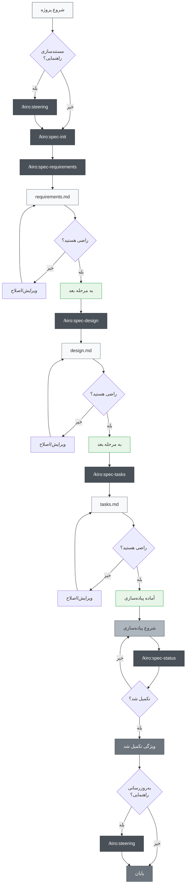
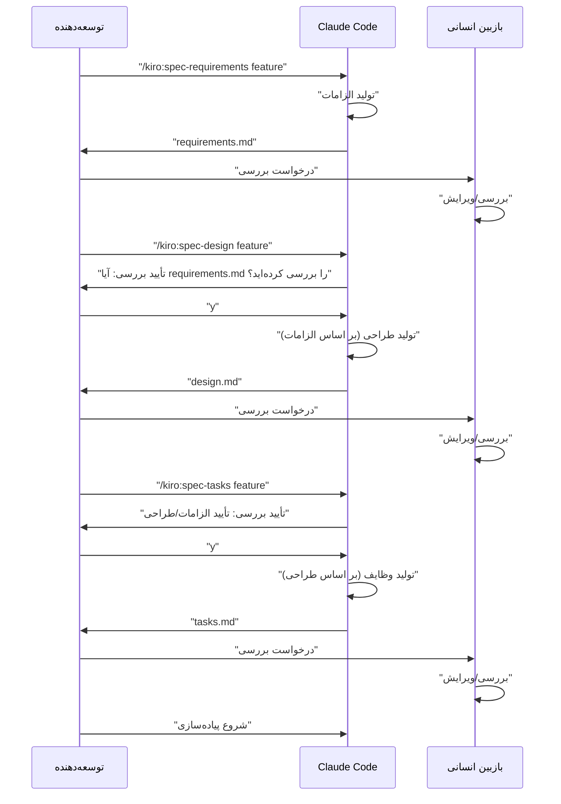

# توسعه مبتنی بر مشخصات Claude Code

> 🌐 **زبان**  
> 📖 **[English Version](README_en.md)** | 📖 **[日本語版 README](README.md)** | 📖 **[简体中文说明](README_zh-CN.md)** | 📖 **[繁體中文說明](README_zh-TW.md)** | 📖 **[العربية](README_ar.md)** | 📖 **فارسی** (این صفحه) | 📖 **[Русский](README_ru.md)**


> [!Warning]
> نسخه اولیه، در حین استفاده به طور مداوم بهبود خواهد یافت

📝 **مقالات مرتبط**  
**[Kiroの仕様書駆動開発プロセスをClaude Codeで徹底的に再現した](https://zenn.dev/gotalab/articles/3db0621ce3d6d2)** - مقاله Zenn

پروژه‌ای برای اجرای توسعه مبتنی بر مشخصات (Spec-Driven Development) تعبیه شده در Kiro IDE با استفاده از دستورات Slash و CLAUDE.md در Claude Code. جریان واقعی توسعه مبتنی بر مشخصات در Kiro را تقریباً به طور کامل، از جمله ساختار دایرکتوری، بازتولید می‌کند.

## نمای کلی

این پروژه مجموعه ابزاری را برای انجام توسعه مبتنی بر مشخصات به طور کارآمد از طریق بهره‌برداری از دستورات Slash در Claude Code فراهم می‌کند. با استفاده از دستورات مناسب در هر مرحله توسعه، می‌توان فرآیند توسعه سیستماتیک و با کیفیت بالا را تحقق بخشید.

## راه‌اندازی

### وارد کردن به پروژه شما

برای وارد کردن توسعه مبتنی بر مشخصات Claude Code به پروژه خود، فقط دو فایل/دایرکتوری زیر را کپی کنید:

1. **دایرکتوری `.claude/commands/`** - تعاریف دستورات Slash
2. **فایل `CLAUDE.md`** - تنظیمات Claude Code و دستورالعمل‌های پروژه


### مراحل راه‌اندازی اولیه

1. **کپی فایل‌ها** (به بالا مراجعه کنید)
2. **کپی CLAUDE.md** و تنظیم آن متناسب با پروژه شما
3. **اجرای اولین دستور**:
   ```bash
   # اختیاری: ایجاد اسناد راهنمایی
   /kiro:steering
   
   # ایجاد اولین مشخصات ویژگی
   /kiro:spec-init "توضیح دقیق پروژه شما"
   ```

### ساختار دایرکتوری مورد نیاز

هنگام اجرای دستورات، دایرکتوری‌های زیر به طور خودکار ایجاد می‌شوند:

```
پروژه شما/
├── .claude/
│   └── commands/          # تعاریف دستورات کپی شده
├── .kiro/
│   ├── steering/          # اسناد راهنمایی تولید شده خودکار
│   └── specs/             # مشخصات ویژگی تولید شده خودکار
├── CLAUDE.md              # کپی شده از فایل‌های زبان خاص (مثلاً: CLAUDE_en.md, CLAUDE_zh-TW.md) و تغییر نام داده شده
├── CLAUDE_en.md           # تنظیمات Claude Code انگلیسی
├── CLAUDE_zh-TW.md        # تنظیمات Claude Code چینی سنتی
├── README.md              # README ژاپنی
├── README_en.md           # README انگلیسی
├── README_zh-TW.md        # README چینی سنتی
└── (فایل‌های پروژه شما)
```

## نحوه استفاده

### 1. در مورد پروژه جدید

```bash
# اختیاری: تولید راهنمایی پروژه (توصیه می‌شود اما اجباری نیست)
/kiro:steering

# مرحله 1: شروع ایجاد مشخصات ویژگی جدید (شامل توضیحات دقیق)
/kiro:spec-init "می‌خواهم ویژگی‌ای ایجاد کنم که کاربران بتوانند PDF آپلود کنند، نمودارها را استخراج کنند و هوش مصنوعی محتوا را توضیح دهد. پشته فناوری از Next.js، TypeScript و Tailwind CSS استفاده می‌کند."

# مرحله 2: تعریف الزامات (استفاده از feature-name تولید شده خودکار)
/kiro:spec-requirements pdf-diagram-extractor
# → بررسی/ویرایش .kiro/specs/pdf-diagram-extractor/requirements.md

# مرحله 3: طراحی فنی (تأیید تعاملی)
/kiro:spec-design pdf-diagram-extractor
# → پاسخ به "آیا requirements.md را بررسی کرده‌اید؟ [y/N]"
# → بررسی/ویرایش .kiro/specs/pdf-diagram-extractor/design.md

# مرحله 4: تولید وظایف (تأیید تعاملی)
/kiro:spec-tasks pdf-diagram-extractor
# → پاسخ به تأیید بررسی الزامات و طراحی
# → بررسی/ویرایش .kiro/specs/pdf-diagram-extractor/tasks.md

# مرحله 5: شروع پیاده‌سازی
```

### 2. افزودن ویژگی به پروژه موجود

```bash
# اختیاری: ایجاد/به‌روزرسانی راهنمایی
# استفاده از همان دستور برای ایجاد جدید و به‌روزرسانی
/kiro:steering

# مرحله 1: شروع ایجاد مشخصات ویژگی جدید
/kiro:spec-init "توضیحات دقیق ویژگی جدید را اینجا بنویسید"
# بعد از آن مانند پروژه جدید
```

### 3. بررسی پیشرفت

```bash
# بررسی پیشرفت ویژگی خاص
/kiro:spec-status my-feature

# مرحله فعلی، وضعیت تأیید، پیشرفت وظایف نمایش داده می‌شود
```

## فرآیند توسعه مبتنی بر مشخصات

### نمودار جریان فرآیند

در این جریان، هر مرحله نیاز به "بررسی و تأیید" دارد.

**اسناد راهنمایی** اسنادی هستند که دانش پایدار درباره پروژه (معماری، پشته فناوری، استانداردهای کد و غیره) را ثبت می‌کنند. ایجاد/به‌روزرسانی اختیاری است اما برای بهبود قابلیت نگهداری بلندمدت پروژه توصیه می‌شود.



## فهرست دستورات Slash

### 🚀 مرحله 0: راهنمایی پروژه (اختیاری)

| دستور | کاربرد | زمان استفاده |
|---------|------|---------------|
| `/kiro:steering` | ایجاد/به‌روزرسانی هوشمند اسناد راهنمایی | همه سناریوها (جدید و به‌روزرسانی) |
| `/kiro:steering-custom` | ایجاد اسناد راهنمایی سفارشی | زمانی که به استانداردها یا دستورالعمل‌های خاص نیاز است |

**توجه**: اسناد راهنمایی توصیه می‌شود اما اجباری نیست. برای افزودن ویژگی‌های کوچک یا توسعه آزمایشی می‌توان آن را حذف کرد.

#### انواع اسناد راهنمایی
- **product.md**: نمای کلی محصول، ویژگی‌ها، موارد استفاده
- **tech.md**: معماری، پشته فناوری، محیط توسعه
- **structure.md**: ساختار دایرکتوری، استانداردهای کد، قوانین نام‌گذاری
- **اسناد سفارشی**: استانداردهای API، استراتژی تست، سیاست امنیتی و غیره

### 📋 مرحله 1: ایجاد مشخصات

| دستور | کاربرد | زمان استفاده |
|---------|------|---------------|
| `/kiro:spec-init [توضیح دقیق پروژه]` | مقداردهی اولیه ساختار مشخصات از توضیح پروژه | هنگام شروع توسعه ویژگی جدید |
| `/kiro:spec-requirements [feature-name]` | تولید سند تعریف الزامات | بلافاصله پس از مقداردهی اولیه مشخصات |
| `/kiro:spec-design [feature-name]` | تولید سند طراحی فنی | پس از تأیید الزامات |
| `/kiro:spec-tasks [feature-name]` | تولید وظایف پیاده‌سازی | پس از تأیید طراحی |

### 📊 مرحله 2: مدیریت پیشرفت

| دستور | کاربرد | زمان استفاده |
|---------|------|---------------|
| `/kiro:spec-status [feature-name]` | بررسی پیشرفت و مرحله فعلی | هر زمان در طول توسعه |

## جریان کار تأیید سه مرحله‌ای

هسته این سیستم درخواست بررسی و تأیید انسانی در هر مرحله است



## بهترین شیوه‌ها

### ✅ موارد توصیه شده

1. **همیشه با راهنمایی شروع کنید**
   - استفاده از `/kiro:steering` در همه سناریوها (تعیین هوشمند ایجاد/به‌روزرسانی)
   - دستور یکپارچه از فایل‌های موجود محافظت کرده و به طور مناسب پردازش می‌کند

2. **مراحل را نادیده نگیرید**
   - رعایت دقیق ترتیب الزامات ← طراحی ← وظایف
   - انجام بررسی انسانی در هر مرحله

3. **بررسی منظم پیشرفت**
   - درک وضعیت فعلی با استفاده از `/kiro:spec-status`
   - به‌روزرسانی مناسب وضعیت تکمیل وظایف

4. **نگهداری راهنمایی**
   - اجرای `/kiro:steering` پس از تغییرات عمده (تعیین خودکار به‌روزرسانی)
   - به‌روزرسانی با رشد پروژه

### ❌ مواردی که باید از آنها اجتناب کرد

1. **انتقال به مرحله بعد بدون تأیید**
   - فراموش نکردن پاسخ به تأیید درخواست

2. **نادیده گرفتن اسناد راهنمایی**
   - اطلاعات قدیمی مانع توسعه می‌شود

3. **عدم به‌روزرسانی وضعیت وظایف**
   - پیشرفت نامشخص شده و مدیریت دشوار می‌شود

## ساختار پروژه

```
.
├── .claude/
│   └── commands/          # تعاریف دستورات slash
│       └── kiro/
│           ├── spec-init.md
│           ├── spec-requirements.md
│           ├── spec-design.md
│           ├── spec-tasks.md
│           ├── spec-status.md
│           ├── steering.md          # دستور راهنمایی یکپارچه
│           └── steering-custom.md
├── .kiro/
│   ├── steering/          # اسناد راهنمایی
│   │   ├── product.md
│   │   ├── tech.md
│   │   └── structure.md
│   └── specs/             # مشخصات ویژگی
│       └── [feature-name]/
│           ├── spec.json      # وضعیت تأیید مرحله
│           ├── requirements.md # سند تعریف الزامات
│           ├── design.md      # سند طراحی فنی
│           └── tasks.md       # وظایف پیاده‌سازی
├── CLAUDE.md              # تنظیمات اصلی (کپی شده از یکی از فایل‌های زبان زیر)
├── CLAUDE_en.md           # تنظیمات انگلیسی
├── CLAUDE_zh-TW.md        # تنظیمات چینی سنتی
├── README.md              # README ژاپنی
├── README_en.md           # README انگلیسی
├── README_zh-TW.md        # README چینی سنتی
└── (فایل‌های پروژه شما)
```

## ویژگی‌های خودکارسازی

موارد زیر از طریق ویژگی قلاب‌های Claude Code خودکار شده‌اند:

- ردیابی خودکار پیشرفت وظایف
- بررسی رعایت مشخصات
- حفظ زمینه هنگام فشرده‌سازی
- تشخیص انحراف راهنمایی

## عیب‌یابی

### وقتی دستورات کار نمی‌کنند
1. بررسی وجود دایرکتوری `.claude/commands/`
2. بررسی قوانین نام‌گذاری فایل دستور (`command-name.md`)
3. بررسی استفاده از آخرین نسخه Claude Code

### وقتی در جریان تأیید گیر کرده‌اید
1. بررسی پاسخ صحیح به درخواست تأیید بررسی
2. بررسی تکمیل تأیید مرحله قبلی
3. تشخیص وضعیت فعلی با `/kiro:spec-status`
4. بررسی/ویرایش دستی `spec.json` در صورت نیاز

## خلاصه

از طریق بهره‌برداری از دستورات slash در Claude Code برای توسعه مبتنی بر مشخصات، می‌توان به موارد زیر دست یافت:

- 📐 فرآیند توسعه سیستماتیک
- ✅ تأیید تدریجی برای تضمین کیفیت
- 📊 مدیریت پیشرفت با شفافیت بالا
- 🔄 به‌روزرسانی مداوم مستندات
- 🤖 بهره‌وری بهبود یافته با کمک هوش مصنوعی

با استفاده از این سیستم، می‌توان کیفیت و کارایی توسعه را به طور قابل توجهی بهبود بخشید.