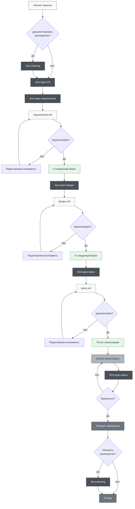
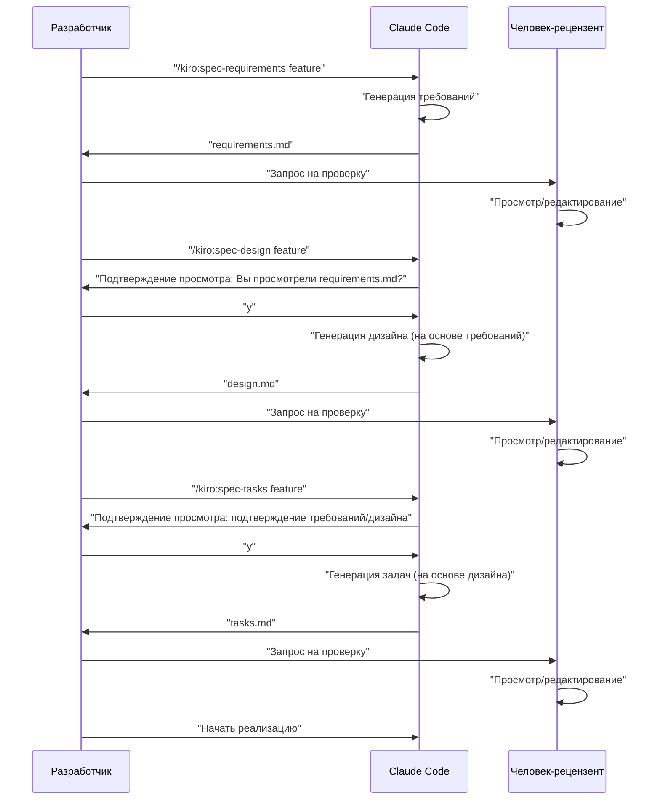

# Разработка на основе спецификаций Claude Code

> 🌐 **Язык**  
> 📖 **[English Version](README_en.md)** | 📖 **[日本語版 README](README.md)** | 📖 **[简体中文说明](README_zh-CN.md)** | 📖 **[繁體中文說明](README_zh-TW.md)** | 📖 **[العربية](README_ar.md)** | 📖 **[فارسی](README_fa.md)** | 📖 **Русский** (эта страница)


> [!Warning]
> Начальная версия, будет постоянно улучшаться в процессе использования

📝 **Связанные статьи**  
**[Kiroの仕様書駆動開発プロセスをClaude Codeで徹底的に再現した](https://zenn.dev/gotalab/articles/3db0621ce3d6d2)** - Статья Zenn

Проект для практики разработки на основе спецификаций (Spec-Driven Development), встроенной в Kiro IDE, с использованием Slash-команд и CLAUDE.md в Claude Code. Практически полностью воспроизводит реальный поток разработки на основе спецификаций в Kiro, включая структуру каталогов.

## Обзор

Этот проект предоставляет набор инструментов для эффективного проведения разработки на основе спецификаций путём использования Slash-команд в Claude Code. Используя соответствующие команды на каждом этапе разработки, можно реализовать систематический и высококачественный процесс разработки.

## Установка

### Внедрение в ваш проект

Чтобы внедрить разработку на основе спецификаций Claude Code в ваш проект, просто скопируйте следующие два файла/каталога:

1. **Каталог `.claude/commands/`** - определения Slash-команд
2. **Файл `CLAUDE.md`** - настройки Claude Code и инструкции проекта


### Шаги начальной настройки

1. **Скопируйте файлы** (см. выше)
2. **Скопируйте CLAUDE.md** и настройте его в соответствии с вашим проектом
3. **Выполните первую команду**:
   ```bash
   # Опционально: создать документы руководства
   /kiro:steering
   
   # Создать первую спецификацию функции
   /kiro:spec-init "детальное описание вашего проекта"
   ```

### Необходимая структура каталогов

При выполнении команд следующие каталоги будут созданы автоматически:

```
ваш-проект/
├── .claude/
│   └── commands/          # Скопированные определения команд
├── .kiro/
│   ├── steering/          # Автоматически создаваемые документы руководства
│   └── specs/             # Автоматически создаваемые спецификации функций
├── CLAUDE.md              # Скопировано из языковых файлов (например: CLAUDE_en.md, CLAUDE_zh-TW.md) и переименовано
├── CLAUDE_en.md           # Настройки Claude Code на английском
├── CLAUDE_zh-TW.md        # Настройки Claude Code на традиционном китайском
├── README.md              # README на японском
├── README_en.md           # README на английском
├── README_zh-TW.md        # README на традиционном китайском
└── (файлы вашего проекта)
```

## Использование

### 1. В случае нового проекта

```bash
# Опционально: генерация руководства проекта (рекомендуется, но не обязательно)
/kiro:steering

# Шаг 1: Начать создание спецификации новой функции (включая детальное описание)
/kiro:spec-init "Хочу создать функцию, где пользователи могут загружать PDF, извлекать диаграммы, и ИИ будет объяснять содержимое. Технологический стек использует Next.js, TypeScript, Tailwind CSS."

# Шаг 2: Определение требований (используя автоматически сгенерированное feature-name)
/kiro:spec-requirements pdf-diagram-extractor
# → Просмотр/редактирование .kiro/specs/pdf-diagram-extractor/requirements.md

# Шаг 3: Техническое проектирование (интерактивное одобрение)
/kiro:spec-design pdf-diagram-extractor
# → Ответ на "Вы просмотрели requirements.md? [y/N]"
# → Просмотр/редактирование .kiro/specs/pdf-diagram-extractor/design.md

# Шаг 4: Генерация задач (интерактивное одобрение)
/kiro:spec-tasks pdf-diagram-extractor
# → Ответ на подтверждение просмотра требований и дизайна
# → Просмотр/редактирование .kiro/specs/pdf-diagram-extractor/tasks.md

# Шаг 5: Начало реализации
```

### 2. Добавление функции в существующий проект

```bash
# Опционально: создание/обновление руководства
# Используйте ту же команду для нового создания и обновления
/kiro:steering

# Шаг 1: Начать создание спецификации новой функции
/kiro:spec-init "Напишите здесь детальное описание новой функции"
# Далее как для нового проекта
```

### 3. Проверка прогресса

```bash
# Проверка прогресса конкретной функции
/kiro:spec-status my-feature

# Будут отображены текущая фаза, статус одобрения, прогресс задач
```

## Процесс разработки на основе спецификаций

### Схема процесса

В этом потоке каждая фаза требует "просмотра и одобрения".

**Документы руководства** - это документы, которые записывают постоянные знания о проекте (архитектура, технологический стек, стандарты кода и т.д.). Создание/обновление необязательно, но рекомендуется для улучшения долгосрочной поддерживаемости проекта.



## Список Slash-команд

### 🚀 Фаза 0: Руководство проекта (опционально)

| Команда | Использование | Когда использовать |
|---------|------|---------------|
| `/kiro:steering` | Умное создание/обновление документов руководства | Все сценарии (новое создание и обновление) |
| `/kiro:steering-custom` | Создание пользовательских документов руководства | Когда нужны специальные стандарты или руководства |

**Примечание**: Документы руководства рекомендуются, но не обязательны. Можно пропустить для небольших добавлений функций или экспериментальной разработки.

#### Типы документов руководства
- **product.md**: Обзор продукта, функции, варианты использования
- **tech.md**: Архитектура, технологический стек, среда разработки
- **structure.md**: Структура каталогов, стандарты кода, правила именования
- **Пользовательские документы**: Стандарты API, стратегия тестирования, политика безопасности и т.д.

### 📋 Фаза 1: Создание спецификаций

| Команда | Использование | Когда использовать |
|---------|------|---------------|
| `/kiro:spec-init [детальное описание проекта]` | Инициализация структуры спецификаций из описания проекта | При начале разработки новой функции |
| `/kiro:spec-requirements [feature-name]` | Генерация документа определения требований | Сразу после инициализации спецификаций |
| `/kiro:spec-design [feature-name]` | Генерация документа технического дизайна | После одобрения требований |
| `/kiro:spec-tasks [feature-name]` | Генерация задач реализации | После одобрения дизайна |

### 📊 Фаза 2: Управление прогрессом

| Команда | Использование | Когда использовать |
|---------|------|---------------|
| `/kiro:spec-status [feature-name]` | Проверка текущего прогресса и фазы | В любое время во время разработки |

## Трёхфазный рабочий процесс одобрения

Ядром этой системы является требование человеческого просмотра и одобрения на каждой фазе



## Лучшие практики

### ✅ Рекомендуемые практики

1. **Всегда начинайте с руководства**
   - Используйте `/kiro:steering` во всех сценариях (умно определяет создание/обновление)
   - Интегрированная команда защищает существующие файлы и обрабатывает их соответствующим образом

2. **Не пропускайте фазы**
   - Строго соблюдайте порядок требования → дизайн → задачи
   - Проводите человеческий просмотр на каждой фазе

3. **Регулярная проверка прогресса**
   - Понимайте текущую ситуацию с помощью `/kiro:spec-status`
   - Соответствующим образом обновляйте статус завершения задач

4. **Поддержание руководства**
   - Выполняйте `/kiro:steering` после крупных изменений (автоматически определяет обновление)
   - Обновляйте по мере роста проекта

### ❌ Чего следует избегать

1. **Переход к следующей фазе без одобрения**
   - Не забывайте отвечать на подтверждение запроса

2. **Игнорирование документов руководства**
   - Устаревшая информация мешает разработке

3. **Не обновление статуса задач**
   - Прогресс становится неясным, управление затруднено

## Структура проекта

```
.
├── .claude/
│   └── commands/          # Определения slash-команд
│       └── kiro/
│           ├── spec-init.md
│           ├── spec-requirements.md
│           ├── spec-design.md
│           ├── spec-tasks.md
│           ├── spec-status.md
│           ├── steering.md          # Интегрированная команда руководства
│           └── steering-custom.md
├── .kiro/
│   ├── steering/          # Документы руководства
│   │   ├── product.md
│   │   ├── tech.md
│   │   └── structure.md
│   └── specs/             # Спецификации функций
│       └── [feature-name]/
│           ├── spec.json      # Статус одобрения фазы
│           ├── requirements.md # Документ определения требований
│           ├── design.md      # Документ технического дизайна
│           └── tasks.md       # Задачи реализации
├── CLAUDE.md              # Основные настройки (скопировано из одного из языковых файлов ниже)
├── CLAUDE_en.md           # Настройки на английском
├── CLAUDE_zh-TW.md        # Настройки на традиционном китайском
├── README.md              # README на японском
├── README_en.md           # README на английском
├── README_zh-TW.md        # README на традиционном китайском
└── (файлы вашего проекта)
```

## Функции автоматизации

Следующее автоматизировано с помощью функции хуков Claude Code:

- Автоматическое отслеживание прогресса задач
- Проверка соответствия спецификациям
- Сохранение контекста при сжатии
- Обнаружение отклонения руководства

## Устранение неполадок

### Когда команды не работают
1. Проверьте наличие каталога `.claude/commands/`
2. Проверьте правила именования файлов команд (`command-name.md`)
3. Проверьте использование последней версии Claude Code

### При застревании в потоке одобрения
1. Проверьте правильность ответа на запрос подтверждения просмотра
2. Проверьте завершение одобрения предыдущей фазы
3. Диагностируйте текущее состояние с помощью `/kiro:spec-status`
4. При необходимости вручную проверьте/отредактируйте `spec.json`

## Заключение

Используя slash-команды в Claude Code для разработки на основе спецификаций, можно достичь следующего:

- 📐 Систематический процесс разработки
- ✅ Поэтапное одобрение для обеспечения качества
- 📊 Высокопрозрачное управление прогрессом
- 🔄 Непрерывное обновление документации
- 🤖 Повышенная эффективность с помощью ИИ

Используя эту систему, можно значительно улучшить качество и эффективность разработки.