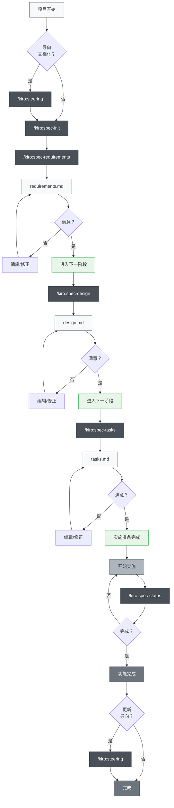
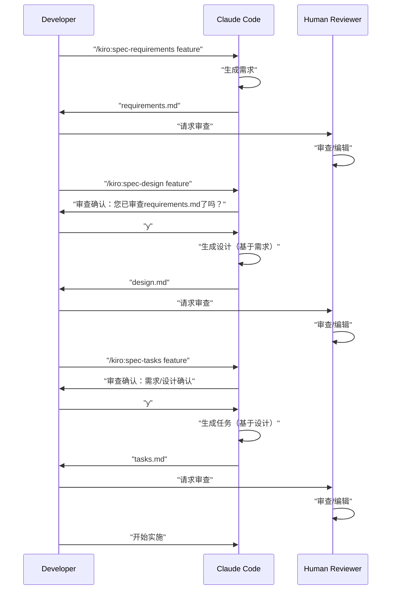

# Claude Code 规范驱动开发

> 🌐 **语言**  
> 📖 **[English Version](README_en.md)** | 📖 **[日本語版 README](README.md)** | 📖 **简体中文说明** (本页面) | 📖 **[繁體中文說明](README_zh-TW.md)** | 📖 **[العربية](README_ar.md)** | 📖 **[فارسی](README_fa.md)** | 📖 **[Русский](README_ru.md)**


> [!Warning]
> 初始版本，将在使用过程中持续改进

📝 **相关文章**  
**[Kiroの仕様書駆動開発プロセスをClaude Codeで徹底的に再現した](https://zenn.dev/gotalab/articles/3db0621ce3d6d2)** - Zenn文章

这是一个使用Claude Code的Slash Commands和CLAUDE.md来实践Kiro IDE内置的规范驱动开发（Spec-Driven Development）的项目。它几乎完整地再现了Kiro中实际的规范驱动开发流程，包括目录结构。

## 概述

本项目提供了一套工具集，通过活用Claude Code的Slash Commands来高效地进行规范驱动开发。通过在各个开发阶段使用适当的命令，可以实现系统化和高质量的开发过程。

## 设置

### 导入到您的项目

要将Claude Code规范驱动开发导入到您的项目中，只需复制以下两个文件/目录即可：

1. **`.claude/commands/` 目录** - Slash Commands的定义
2. **`CLAUDE.md` 文件** - Claude Code的设置和项目指示


### 初始设置步骤

1. **复制文件**（参见上文）
2. **复制CLAUDE.md**并根据您的项目进行调整
3. **执行第一个命令**：
   ```bash
   # 可选：创建导向文档
   /kiro:steering
   
   # 创建第一个功能规范
   /kiro:spec-init "您的项目的详细描述"
   ```

### 必需的目录结构

执行命令时，将自动创建以下目录：

```
您的项目/
├── .claude/
│   └── commands/          # 复制的命令定义
├── .kiro/
│   ├── steering/          # 自动生成的导向文档
│   └── specs/             # 自动生成的功能规范
├── CLAUDE.md              # 从语言特定文件（例如：CLAUDE_en.md, CLAUDE_zh-TW.md）复制并重命名
├── CLAUDE_en.md           # 英文版 Claude Code 设置
├── CLAUDE_zh-TW.md        # 繁体中文版 Claude Code 设置
├── README.md              # 日文版 README
├── README_en.md           # 英文版 README
├── README_zh-TW.md        # 繁体中文版 README
└── （您的项目文件）
```

## 使用方法

### 1. 新项目的情况

```bash
# 可选：生成项目导向（推荐但非必需）
/kiro:steering

# 步骤1：开始创建新功能的规范（包括详细描述）
/kiro:spec-init "用户可以上传PDF，提取其中的图表，AI将解释内容的功能。技术栈使用Next.js、TypeScript、Tailwind CSS。"

# 步骤2：需求定义（使用自动生成的feature-name）
/kiro:spec-requirements pdf-diagram-extractor
# → 审查/编辑 .kiro/specs/pdf-diagram-extractor/requirements.md

# 步骤3：技术设计（交互式批准）
/kiro:spec-design pdf-diagram-extractor
# → 回应 "您已审查requirements.md了吗？ [y/N]"
# → 审查/编辑 .kiro/specs/pdf-diagram-extractor/design.md

# 步骤4：任务生成（交互式批准）
/kiro:spec-tasks pdf-diagram-extractor
# → 回应需求和设计的审查确认
# → 审查/编辑 .kiro/specs/pdf-diagram-extractor/tasks.md

# 步骤5：开始实施
```

### 2. 向现有项目添加功能

```bash
# 可选：创建/更新导向
# 新创建和更新都使用相同的命令
/kiro:steering

# 步骤1：开始创建新功能的规范
/kiro:spec-init "在此描述新功能的详细信息"
# 之后与新项目相同
```

### 3. 进度确认

```bash
# 确认特定功能的进度
/kiro:spec-status my-feature

# 将显示当前阶段、批准状态、任务进度
```

## 规范驱动开发流程

### 流程图

在此流程中，每个阶段都需要"审查和批准"。

**导向文档**是记录有关项目的持久知识（架构、技术栈、代码规范等）的文档。创建/更新是可选的，但建议用于提高项目的长期可维护性。



## 斜杠命令列表

### 🚀 阶段0：项目导向（可选）

| 命令 | 用途 | 使用时机 |
|---------|------|---------------|
| `/kiro:steering` | 智能创建/更新导向文档 | 所有场景（新建和更新） |
| `/kiro:steering-custom` | 创建自定义导向文档 | 需要特殊规范或指南时 |

**注意**：导向文档是推荐的但不是必需的。对于小规模功能添加或试验性开发可以省略。

#### 导向文档的类型
- **product.md**：产品概述、功能、用例
- **tech.md**：架构、技术栈、开发环境
- **structure.md**：目录结构、代码规范、命名规则
- **自定义文档**：API规范、测试策略、安全策略等

### 📋 阶段1：规范创建

| 命令 | 用途 | 使用时机 |
|---------|------|---------------|
| `/kiro:spec-init [详细的项目描述]` | 从项目描述初始化规范结构 | 开始新功能开发时 |
| `/kiro:spec-requirements [feature-name]` | 生成需求定义文档 | 规范初始化后立即 |
| `/kiro:spec-design [feature-name]` | 生成技术设计文档 | 需求批准后 |
| `/kiro:spec-tasks [feature-name]` | 生成实施任务 | 设计批准后 |

### 📊 阶段2：进度管理

| 命令 | 用途 | 使用时机 |
|---------|------|---------------|
| `/kiro:spec-status [feature-name]` | 确认当前进度和阶段 | 开发过程中随时 |

## 三阶段批准工作流程

该系统的核心是在每个阶段都必须进行人工审查和批准



## 最佳实践

### ✅ 推荐事项

1. **始终从导向开始**
   - 在所有场景中使用 `/kiro:steering`（智能判断新建/更新）
   - 集成命令保护现有文件并适当处理

2. **不要跳过阶段**
   - 严格遵守需求 → 设计 → 任务的顺序
   - 在每个阶段必须进行人工审查

3. **定期进度确认**
   - 使用 `/kiro:spec-status` 了解当前状况
   - 适当更新任务完成状态

4. **导向的维护**
   - 重大更改后执行 `/kiro:steering`（自动判断更新）
   - 随着项目的发展进行更新

### ❌ 应避免的事项

1. **未经批准进入下一阶段**
   - 不要忘记对提示的确认响应

2. **忽略导向文档**
   - 过时的信息会阻碍开发

3. **未更新任务状态**
   - 进度变得不明确，管理困难

## 项目结构

```
.
├── .claude/
│   └── commands/          # 斜杠命令定义
│       └── kiro/
│           ├── spec-init.md
│           ├── spec-requirements.md
│           ├── spec-design.md
│           ├── spec-tasks.md
│           ├── spec-status.md
│           ├── steering.md          # 集成导向命令
│           └── steering-custom.md
├── .kiro/
│   ├── steering/          # 导向文档
│   │   ├── product.md
│   │   ├── tech.md
│   │   └── structure.md
│   └── specs/             # 功能规范
│       └── [feature-name]/
│           ├── spec.json      # 阶段批准状态
│           ├── requirements.md # 需求定义文档
│           ├── design.md      # 技术设计文档
│           └── tasks.md       # 实施任务
├── CLAUDE.md              # 主设置（从以下任一语言文件复制）
├── CLAUDE_en.md           # 英文版设置
├── CLAUDE_zh-TW.md        # 繁体中文版设置
├── README.md              # 日文版 README
├── README_en.md           # 英文版 README
├── README_zh-TW.md        # 繁体中文版 README
└── （您的项目文件）
```

## 自动化功能

通过Claude Code的钩子功能实现了以下自动化：

- 任务进度的自动跟踪
- 规范遵守检查
- 压缩时的上下文保持
- 导向漂移检测

## 故障排除

### 命令不工作时
1. 确认 `.claude/commands/` 目录存在
2. 确认命令文件的命名规则（`command-name.md`）
3. 确认使用最新版本的Claude Code

### 批准流程卡住时
1. 确认正确响应审查确认提示
2. 确认前一阶段的批准已完成
3. 使用 `/kiro:spec-status` 诊断当前状态
4. 必要时手动确认/编辑 `spec.json`

## 总结

通过活用Claude Code的斜杠命令进行规范驱动开发，可以实现以下效果：

- 📐 系统化的开发流程
- ✅ 用于质量保证的阶段性批准
- 📊 高透明度的进度管理
- 🔄 持续的文档更新
- 🤖 AI辅助提高效率

使用此系统可以大幅提高开发的质量和效率。