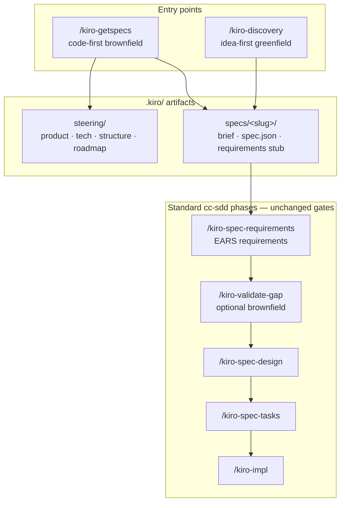
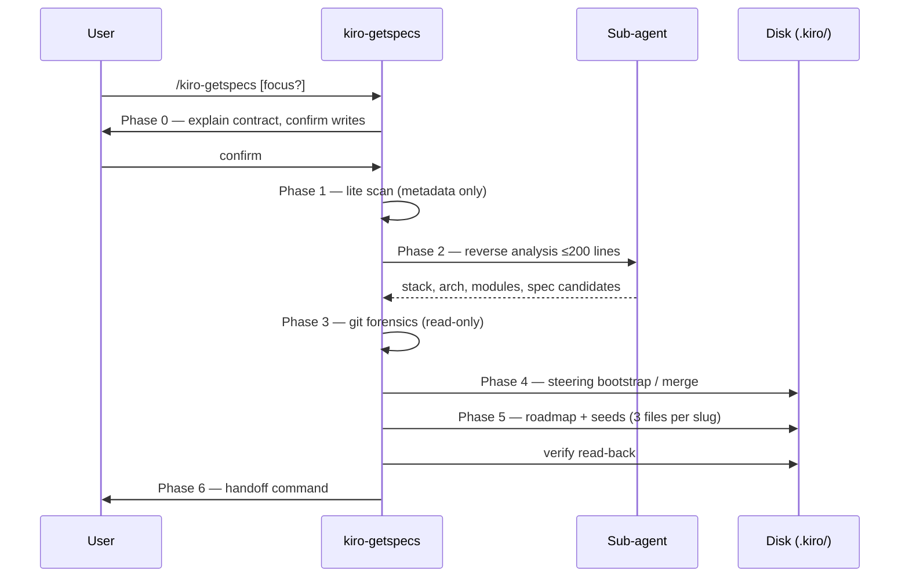
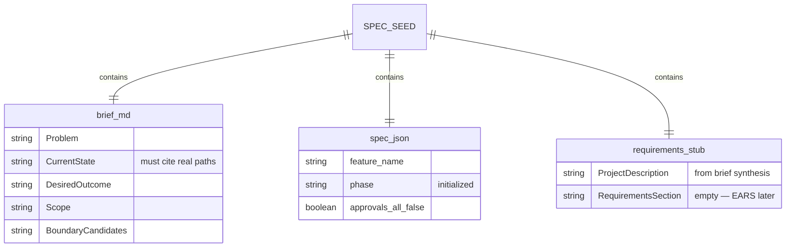

# Brownfield Bootstrap with `/kiro-getspecs`

> Adapted from brownfield reverse-engineering patterns (spec-kit brownfield extensions) into native cc-sdd `.kiro/` artifacts.

## What it does

`/kiro-getspecs` is the **code-first entry point** for adopting cc-sdd on an existing repository.

It reverse-engineers the project and writes durable artifacts under `.kiro/`:

| Output | Purpose |
|--------|---------|
| `steering/product.md`, `tech.md`, `structure.md` | Project memory (patterns, not catalogs) |
| `steering/roadmap.md` | Ordered backlog of spec boundaries |
| `specs/<slug>/brief.md` | Brownfield brief grounded in **current code** |
| `specs/<slug>/spec.json` | Initialized spec metadata (`phase: initialized`) |
| `specs/<slug>/requirements.md` | **Stub only** — project description (same as `/kiro-spec-init`); EARS section empty |

It does **not** write EARS acceptance criteria, `design.md`, or `tasks.md`. Those remain gated behind the normal cc-sdd workflow.

## Why it exists

| Problem | Without getSpecs | With getSpecs |
|---------|------------------|---------------|
| Existing repo, no specs | `/kiro-discovery` assumes you have an **idea** | Reads **code** first |
| Onboarding | Manual steering + many `/kiro-spec-init` calls | One pass → roadmap + seeds |
| Wrong tool | spec-kit `.specify/` parallel tree | Single `.kiro/` contract (Kiro-compatible) |
| Over-scoping | One giant spec | Module/git-informed boundaries |

`/kiro-discovery` routes **new work**. `/kiro-getspecs` bootstraps **existing work**.

## Position in the cc-sdd pipeline



## Six-phase protocol (detailed)



## Spec seed contract (per slug)

Each seed is **not** a complete spec. It is a brownfield handoff bundle compatible with `/kiro-spec-init` and `/kiro-spec-requirements`:



| File | Written by getSpecs | Written by later skills |
|------|---------------------|------------------------|
| `brief.md` | Yes — brownfield context | Read by requirements/design |
| `spec.json` | Yes — `phase: initialized` | Updated by each phase gate |
| `requirements.md` | Yes — **stub only** | EARS body by `/kiro-spec-requirements` |
| `design.md` | No | `/kiro-spec-design` |
| `tasks.md` | No | `/kiro-spec-tasks` |

## How it works (6 phases — summary)

```
Phase 0  Gate        Confirm brownfield + user approval before writes
Phase 1  Lite scan   Metadata only (.kiro inventory, root listing)
Phase 2  Reverse     Sub-agent summary ≤200 lines (stack, arch, modules)
Phase 3  Git         Optional branch/commit themes (read-only)
Phase 4  Steering    Bootstrap or additive merge of product/tech/structure
Phase 5  Seeds       roadmap.md + brief.md + spec.json + requirements.md stub per slug
Phase 6  Handoff     /kiro-spec-requirements or /kiro-spec-batch
```

### Design choices

1. **Seeds, not EARS** — `requirements.md` stub matches `/kiro-spec-init`; EARS stays in `/kiro-spec-requirements`.
2. **Sub-agent for exploration** — Heavy codebase reads stay out of main context (same pattern as `/kiro-discovery`).
3. **Additive steering** — Never silently replace user-authored steering.
4. **No `.specify/`** — Avoids parallel spec trees incompatible with Kiro/cc-sdd portability.
5. **Git as signal, not truth** — Commit themes prioritize seeds; they do not invent features.

## When to use

**Use `/kiro-getspecs` when:**

- The repo has real implementation but empty or incomplete `.kiro/specs/`
- The team is adopting cc-sdd mid-flight
- You need steering + a spec backlog from code reality

**Use `/kiro-discovery` instead when:**

- You have a new feature idea on a project that already has specs/steering
- Greenfield scaffold with little code

**Use `/kiro-validate-gap` after:**

- `/kiro-spec-requirements` for a single brownfield spec (per-feature gap analysis)

## Typical workflow

```bash
# 1. Install cc-sdd skills (once)
npx cc-sdd@latest --cursor-skills

# 2. Bootstrap from existing code
/kiro-getspecs

# 3. Turn seeds into specs (pick one)
/kiro-spec-requirements auth-service
/kiro-spec-batch

# 4. Continue normal cc-sdd pipeline
/kiro-spec-design auth-service
/kiro-spec-tasks auth-service
/kiro-impl auth-service
```

Optional focus area:

```bash
/kiro-getspecs payments module
```

## Skill files

Installed to `.cursor/skills/kiro-getspecs/` (path varies by agent):

- `SKILL.md` — orchestration protocol
- `rules/getspecs-principles.md` — brownfield principles
- `references/analysis-guide.md` — reverse-engineering checklist
- `references/spec-seed-template.md` — brief, roadmap, requirements stub templates

## Credits

Logic distilled from [spec-kit brownfield extensions](https://github.com/Pimzino/spec-kit-brownfield-extensions) and mapped to cc-sdd `.kiro/` outputs. spec-kit `.specify/` artifacts are intentionally **not** generated.

## Related

- [Skill Reference](./skill-reference.md)
- [Why cc-sdd?](./why-cc-sdd.md)
